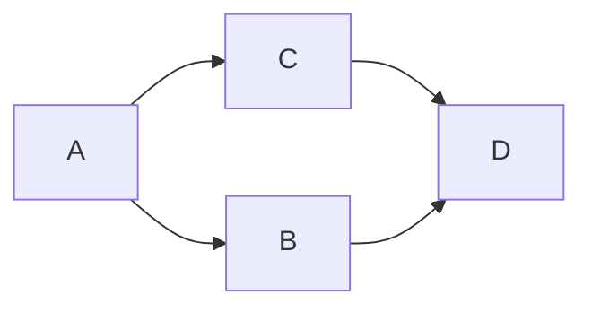

## 拓扑排序

拓扑排序是一种对有向无环图进行排序的算法, 如下图:



按照拓扑排序输出即为: A -> B -> C -> D 或者 A -> C -> B -> D,  按照从前到后的顺序进行排序, 即为拓扑排序

```python
def solution(num: int, prerequire: List[List[int]]) ->bool:
    num_count = 0
    count_list = [0 for i in range(num)]
    after_list = [[] for i in range(num)]
    result = deque()
    for l in prerequire:
        after_list[l[1]].append(l[0])
        count_list[l[0]] += 1
    print(count_list)
    print(after_list)
    for i in range(num):
        if count_list[i] == 0:
            result.append(i)

    while result:
        r = result.popleft()
        num_count += 1
        print("r: %d" % r)
        for a in after_list[r]:
            count_list[a] -= 1
            if count_list[a] == 0:
                result.append(a)

    return num_count == num
```

